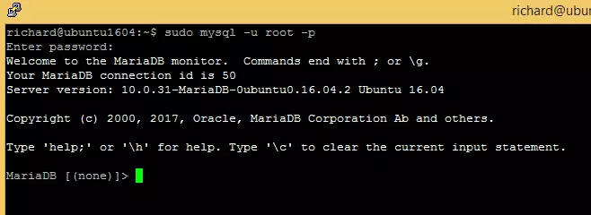

# MYSQL

## Install process of mysql in Obuntu OS

### install mariadb - 
    
Step1. To install MariaDB run the commands below:

    sudo apt-get install mariadb-server mariadb-client

Step 2. After installing MariaDB, the commands below can be used to stop, start and enable MariaDB service to always start up when the server boots.

Run these on Ubuntu 18.10 18.04 and 20.04 LTS

    sudo systemctl stop mariadb.service
    sudo systemctl start mariadb.service
    sudo systemctl enable mariadb.service

Run these on Ubuntu 16.04 LTS

    sudo systemctl stop mysql.service
    sudo systemctl start mysql.service
    sudo systemctl enable mysql.service

Step 3. Next, run the commands below to secure the database server with a root password if you were not prompted to do so during the installation.

    sudo mysql_secure_installation

Step 4. When prompted, answer the questions below by following the guide.

1. Enter current password for root (enter for none): Just press the Enter
2. Set root password? [Y/n]: Y
3. New password: Enter password
4. Re-enter new password: Repeat password
5. Remove anonymous users? [Y/n]: Y
6. Disallow root login remotely? [Y/n]: Y
7. Remove test database and access to it? [Y/n]:  Y
8. Reload privilege tables now? [Y/n]:  Y

Step 5. Now that MariaDB is installed, to test whether the database server was successfully installed, run the commands below.

    sudo mysql -u root -p

type the root password when prompted.

If you see a similar screen as shown below, then the server was successfully installed.

STep 6.Change authentication plugin to be able to login as normal user with root credentials.

    $ sudo mysql -u root
    UPDATE mysql.user SET plugin = 'mysql_native_password' WHERE User = 'root';
    FLUSH PRIVILEGES;
    QUIT;
